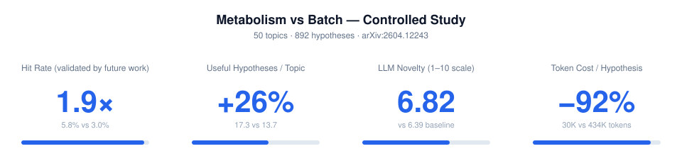

<h1 align="center">Scientify</h1>

  <em>End-to-End AI Research That Continuously Evolves</em>

  <a href="https://scientify.tech">Scientify.tech</a> · <a href="./README.md">中文</a>

## 1. End-to-End Autonomous Research: Continuous Iteration, SOTA-Level Results

Give Scientify a research objective. It autonomously surveys the literature, generates hypotheses, implements code, reviews the implementation, and runs experiments, then refines the research direction based on the results.

Scientify advances research through multi-agent iteration. An orchestrator retains the hypotheses and accumulated knowledge, coordinating independent agents for implementation, review, and experimentation. Each round contributes experience to the next, helping the research progress along more effective paths.

### Case Study 1: Autonomously Discovering KV2 with Field-Leading Performance

**Research objective**: Design a strategy for long-context LLM inference that reduces both time to first token and communication volume per request.

Scientify autonomously completed the literature survey, hypothesis generation, code implementation, and ablation experiments to propose the **KV2 algorithm**. Compared with existing research, KV2 reduced both the 95th percentile of time to first token (TTFT p95) and communication volume per request (bytes/request), achieving **SOTA-level performance**.

  
   
  A paper autonomously produced by Scientify, presenting the KV2 design and experimental results

  
   
  KV2 performance compared with existing methods

### Case Study 2: Discovering Three Black-Hole Transition Boundaries and Deriving and Testing Their Conditions

Scientify independently performed the theoretical derivations, numerical analysis, and manuscript preparation for [Equilibrium Gibbs Bifurcations of Bardeen-AdS Black Holes at Fixed Pressure](https://arxiv.org/abs/2606.00099v1).

**Research question**: The paper studies a black hole with a smooth central region. As the scale of that region increases, can small and large black holes still coexist stably at the same temperature? Under what conditions does that coexistence disappear?

- **Finding three transitions in the calculations**: Scientify calculated black-hole temperature and free energy, which compares the stability of competing states, at different central-region scales. It found that the free-energy curve changes from a swallow-tail to an 8-shape, then a c-shape, and finally a single branch, and located all three changes.
- **Building a model that predicts transition conditions**: Scientify derived how the central-region scale at each transition decreases as thermodynamic pressure rises: quadrupling the pressure halves that scale. It also obtained the exact condition at which the temperature curve becomes single-branched, allowing this boundary to be calculated directly at a given pressure.
- **Checking predictions and stable coexistence**: Scientify checked the transition boundaries numerically at three pressures, then tested whether small and large black holes were individually stable and had equal free energy. Stable coexistence persists after the swallow-tail becomes an 8-shape; it is absent in the c-shaped example examined.

## 2. Leading Agent Performance: Related Paper Accepted at ICML 2026

Scientify uses **continuous knowledge metabolism**: it follows emerging literature, connects new findings with accumulated knowledge, and refines hypotheses using experimental results. Knowledge, hypotheses, and experimental experience persist across research rounds, enabling deeper investigation over time.

We compared Scientify's continuous knowledge metabolism with the processing approach of traditional agents across **50 research topics and 892 generated hypotheses**. Scientify achieved **1.9 times** the baseline hypothesis hit rate, generated **26% more** useful hypotheses per topic, and reduced Token costs by **92%**.

> **The paper has been accepted at ICML 2026.**
>
> [Continuous Knowledge Metabolism: Generating Scientific Hypotheses from Evolving Literature](https://arxiv.org/abs/2604.12243)

  

| Metric | Batch baseline | Metabolism | Difference |
|--------|----------------|------------|------------|
| Hit rate: fraction of hypotheses validated by later papers | 3.0% | **5.8%** | **1.9 times** |
| Useful hypotheses per topic | 13.7 | **17.3** | **+26%** |
| LLM-judged novelty (1–10 scale) | 6.39 | **6.82** | **+0.43** |
| Token cost per hypothesis | 434K | **30K** | **92% lower** |

## 3. How to Use Scientify

Visit **[Scientify.tech](https://scientify.tech)**, sign up or log in, and enter your research objective in the workspace to begin.

Scientify runs research tasks continuously on an isolated cloud computer, keeping papers, code, data, and experimental results in one workspace. Tasks continue after you close your computer. Return from your phone or another device to check progress, add materials, and continue your research.
