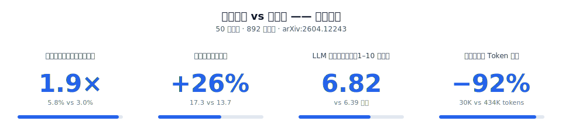

<h1 align="center">Scientify</h1>
<p align="center">
  <em>持续新陈代谢的 AI 科研系统</em>
</p>

<p align="center">
  <a href="https://www.npmjs.com/package/scientify"></a>
  <a href="https://github.com/tsingyuai/scientify"></a>
  <a href="LICENSE"></a>
  <a href="https://github.com/openclaw/openclaw"></a>
</p>

<p align="center">
  <a href="https://scientify.tech">官网</a> · <a href="./README.en.md">English</a> · <a href="https://github.com/tsingyuai/scientify/issues">Issues</a>
</p>

---

## 它能做什么

> [!IMPORTANT]
> Scientify 不是一个"问一次答一次"的 AI 工具。它像一个真正的研究伙伴——**持续思考、持续积累、持续交付**。

### 1. 新陈代谢：持续思考，而非一次性回答

现有 AI 科研工具的工作方式是**批处理**——给个问题，跑一遍 pipeline，输出报告，结束。下次再问同一个方向，从零开始。跑 10 次和跑 1 次没有本质区别。

但人类研究者不是这样工作的。你每天在读、在跑、在想。昨天的失败改变了今天的阅读，上周的对话改变了这周的实验设计。

Scientify 采用**新陈代谢模式**——持续地摄入、消化、沉淀、再摄入：

- **持续摄入**：每天自动跟进前沿论文，不需要你手动触发
- **消化沉淀**：将新知识与已有积累关联，写入持久化知识库
- **假设进化**：淘汰无效假设，进化有效路径，每一轮失败都是下一轮的养料
- **主动交付**：发现值得关注的进展后自动验证，验证通过主动推送给你

用得越久，它研究越深入。

<p align="center">
  
  <br>
  <sub>Scientify 通过飞书主动向研究者推送最新发现，并结合知识库产生思考</sub>
</p>

#### 它有多大优势？我们做了一项受控研究

新陈代谢模式不只是一个工程选择——它带来的是质的不同。我们在 **50 个研究主题、892 条生成假设** 上对照测试了新陈代谢与传统批处理范式，论文：[arXiv:2604.12243](https://arxiv.org/abs/2604.12243)。

<p align="center">
  
</p>

| 指标 | 批处理基线 | 新陈代谢 | 差异 |
|------|-----------|---------|------|
| 命中率 — 假设方向被后续论文验证的比例 | 3.0% | **5.8%** | **1.9×（接近翻倍）** |
| 单主题有效假设数 | 13.7 | **17.3** | **+26%** |
| LLM 评判的新颖性（1–10 分制） | 6.39 | **6.82** | **+0.43** |
| 单条假设的 Token 成本 | 434K | **30K** | **−92%** |

> 📄 详见 [Continuous Knowledge Metabolism: Generating Scientific Hypotheses from Evolving Literature](https://arxiv.org/abs/2604.12243)

### 2. 端到端自主研究：做到 SOTA 级成果

给它一个课题，它自己把研究做完，跑出性能超越外部文献水平的新算法。

多 Agent 迭代驱动：编排器持有假设和全部积累，只调度不写代码；每轮 spawn 独立子 agent 执行实现、审查、实验；每一轮失败都沉淀为下一轮的经验，假设越修正越精确，直到发现更优的方法。

### Showcase：自主发现 KV2 算法并达到领域领先性能

> **目标**：针对长上下文 LLM 推理，设计一种策略，同时降低首 token 时延和单请求通信量。
>
> Scientify 自主完成文献调研、假设生成、代码实现与消融实验验证，提出 **KV2 算法**，相较于现有研究，TTFT p95和bytes/request均有不同程度降低，性能达到 SOTA 水平。

<p align="center">
  
  <br>
  <sub>Scientify 独立产出的学术论文，报道KV2的设计思路与结果</sub>
</p>

<p align="center">
  
  <br>
  <sub>KV2 与现有方法的 SOTA 对比</sub>
</p>

---

## 架构

```
┌─────────────────────────────────────────────────────────────┐
│  研究者                                                      │
│  对话 · 投喂材料 · 判断假设                                    │
└──────────────┬──────────────────────────────┬───────────────┘
               ↓                              ↓
┌──────────────────────────┐   ┌──────────────────────────────┐
│  Agent 层                 │   │  知识库（持久化）               │
│                          │   │                              │
│  Heartbeat  每天定时唤醒  │←→│  _index.md                   │
│  Reflection 自主跨领域探索│   │  topic-*.md                  │
│  Pipeline   假设验证执行  │   │  hypotheses/                 │
│                          │   │  experiments/                │
└──────────┬───────────────┘   │  conversations/              │
           ↓                   │                              │
┌──────────────────────────┐   │  Markdown 文件 · Git 管理     │
│  工具层                   │   │  完全可审计 · 你也能编辑       │
│                          │──→│                              │
│  arxiv_search            │   └──────────────────────────────┘
│  openalex_search         │
│  github_search           │
│  paper_browser           │
│  code_executor           │
└──────────────────────────┘
```

四个部分，各司其职：

### 研究者

你是系统的一部分。通过对话注入判断、投喂材料、确认或否决假设。你的参与让新陈代谢的方向更准确，让研究假设更精确。

### Agent 层

三个循环驱动新陈代谢：

| Agent | 做什么 | 触发方式 |
|-------|--------|---------|
| **Heartbeat** | 每天跟进前沿论文，发现关联后自主验证，验证通过主动推送给你 | 定时自动唤醒 |
| **Reflection** | 跨领域探索，将不同主题的知识关联起来，发现意想不到的联系 | Heartbeat 触发 / 研究者触发 |
| **Pipeline** | 端到端研究执行——文献调研 → 深度分析 → 实现 → 审查 → 实验 | 研究者触发 / Reflection 触发 |

Pipeline 内部是多 Agent 迭代：编排器持有假设，spawn 子 agent 执行实现（`implement`）、审查（`review`）、实验（`experiment`）。每轮失败沉淀为经验，假设越修正越精确。

### 工具层

Agent 的手和眼：

| 工具 | 能力 |
|------|------|
| `arxiv_search` / `openalex_search` | 搜索学术论文（arXiv + 跨学科） |
| `github_search` | 搜索开源代码实现 |
| `paper_browser` | 分页精读论文，避免上下文溢出 |
| `code_executor` | 在 `uv` 隔离环境中执行实验代码 |

> Scientify 运行在 [OpenClaw](https://github.com/openclaw/openclaw) 之上，天然可调用平台的 MCP 服务器（Slack / 飞书推送）、浏览器自动化（付费文献下载）、多会话并发（多方向并行研究）等能力。

### 知识库

所有积累持久化为 Markdown 文件，Git 管理，每一行变化都可追溯。你和 Agent 读写的是同一组文件：

```
knowledge_state/
├── _index.md              # 研究全局索引
├── topic-*.md             # 按主题组织的知识沉淀
├── hypotheses/            # 假设演化记录
├── experiments/           # 实验结果与分析
├── paper_notes/           # 逐篇论文深读记录
└── logs/                  # 每轮新陈代谢的运行日志
```

---

## 环境要求

- **Node.js** >= 18
- **Python 3** + **uv**（用于 ML 代码执行）
- **git**

---

## 安装 OpenClaw

```bash
# 全局安装 OpenClaw
pnpm add -g openclaw    # 或: npm install -g openclaw

# 运行引导向导（配置模型提供商、API Key、工作空间）
openclaw onboard

# 启动 Gateway（WebUI 服务器）
openclaw gateway
```

启动后，WebUI 地址为 **http://127.0.0.1:18789/**（默认端口）。

> **代理用户注意：** 如果你设置了 `http_proxy`，访问 WebUI 时需加 `--noproxy 127.0.0.1`，或在浏览器中配置代理例外。

---

## 安装 Scientify

```bash
openclaw plugins install "$(npm pack scientify)"
```

插件安装到 `~/.openclaw/extensions/`，自动启用。

### 从源码安装（开发用）

```bash
git clone https://github.com/tsingyuai/scientify.git
cd scientify && pnpm install && pnpm build

# 链接为开发插件
openclaw plugins install -l ./
```

### 验证安装

```bash
openclaw plugins list
# 应显示: Scientify (loaded)
```

安装后需 **重启 Gateway** 以加载插件：

```bash
# 停止运行中的 Gateway（Ctrl+C），然后：
openclaw gateway
```

---

## 通过 WebUI 使用

### 1. 打开 WebUI

浏览器访问 **http://127.0.0.1:18789/**。

### 2. 开始研究任务

在聊天框中输入研究提示，Scientify 的 skill 会被 LLM 自动匹配：

```
研究 "transformer efficiency"，分析论文并生成创新想法
```

或者用斜杠命令直接调用特定 skill：

```
/research-pipeline
/research-collect
/idea-generation
/algorithm-selection
/dataset-validate
```

## 机器学习中段任务的新增技能

- `/algorithm-selection`
  - 用在 `/research-survey` 之后、`/research-plan` 之前
  - 作用：把 2-3 条候选路线写清楚，明确 `Chosen Route / Rejected Routes / Fallback Route`
- `/dataset-validate`
  - 用在 `plan_res.md` 已经存在、准备实现或审查模型之前
  - 作用：单独审数据真实性、split、label、leakage 和 mock 风险，把数据质量和模型质量分开
- `/baseline-runner`
  - 用在 `plan_res.md` 已经存在、需要真实 baseline 对比时
  - 作用：统一 baseline、协议、指标和结果记录，产出 `baseline_res.md`

### 3. 监控子 agent 进度

编排器 spawn 子 agent 后，你会看到：
- **启动通知** — "Phase 1: Literature Survey 已启动"
- **完成通知** — 子 agent 完成后自动发送消息
- **进度推进** — 编排器验证产出后自动进入下一阶段

随时查看状态：

```
/research-status
```

### 4. 管理项目

```
/projects              # 列出所有项目
/project-switch <id>   # 切换项目
/papers                # 列出已下载论文
/ideas                 # 列出已生成想法
```

## 中后段项目的快捷技能

如果项目已经有一部分产物，不必总是从 `/metabolism` 或 `/research-survey` 重新开始。可以直接进入这些 skill：

- `/write-paper`
  - 适合：已经有 `experiment_res.md`、结果图或结果表，准备整理成 paper draft
- `/artifact-review`
  - 适合：已有 draft、README 更新或准备对外分享的 figures，想先做发布前审查
- `/figure-standardize`
  - 适合：图已经有了，但文件名、caption、单位、标签风格不统一
- `/release-layout`
  - 适合：项目已有成果，想把 README 或 release 入口改得更清楚、更适合外部阅读

---

## 已知限制

- **子 agent 超时**：每个子 agent 超时 30 分钟（`runTimeoutSeconds: 1800`）。复杂文献调研可能需要更长时间。
- **GPU/Sandbox**：代码默认在宿主机直接执行。OpenClaw sandbox 暂不支持 GPU 透传。
- **模型依赖**：研究质量与使用的 LLM 模型强相关。推荐 Claude Opus 4.5+ 或 GPT-5+。

---

## 开发

```bash
git clone https://github.com/user/scientify.git
cd scientify
pnpm install
pnpm build          # 构建 TypeScript
pnpm dev            # 监听模式

# 链接到 OpenClaw 测试
openclaw plugins install -l ./
```

参见 [CLAUDE.md](./CLAUDE.md) 了解版本更新流程和贡献指南。

---

## 内测报名

Scientify 目前处于内测阶段，面向有真实研究需求的个人和团队开放。

报名后，我们会为你提供：

1. 详细的使用指导，帮助你快速上手
2. 评估你的研究领域，分析 Scientify 执行端到端研究的可行性
3. 根据你的研究特点推荐最适合的使用方法
4. 根据你的需求快速开发新功能

<p align="center">
  <a href="https://tsingyuai.feishu.cn/share/base/form/shrcne78pTl0NJ9gQqVPDvWm7Wb">
    
  </a>
  <br>
  <sub><a href="https://tsingyuai.feishu.cn/share/base/form/shrcne78pTl0NJ9gQqVPDvWm7Wb">扫描二维码，或者点我立即报名内测</a></sub>
</p>

---

## License

MIT

## Author

tsingyuai
