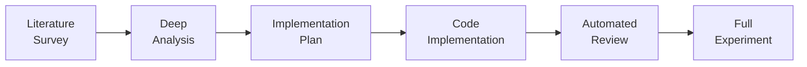
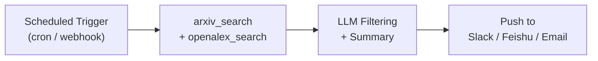
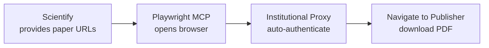
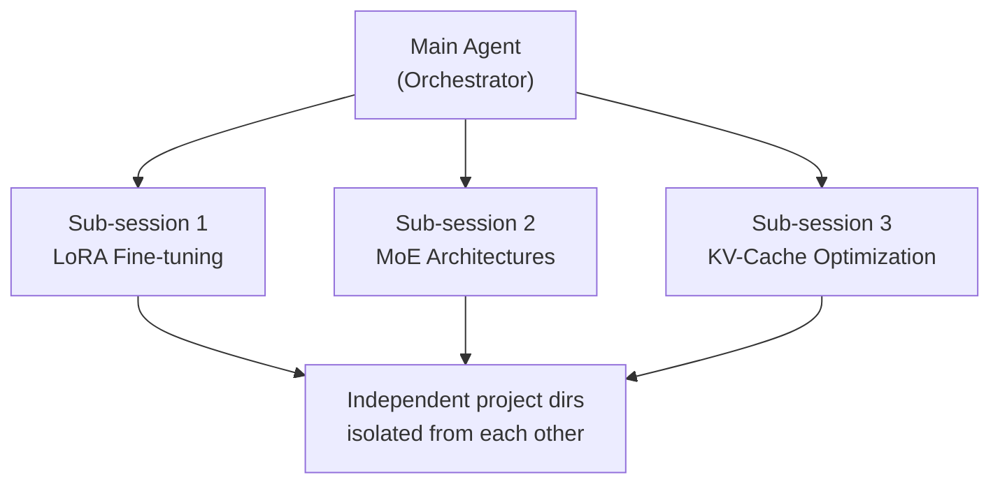
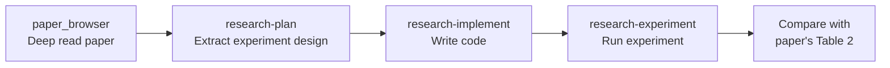

# Scientify

**AI-powered research workflow automation for OpenClaw.**

Scientify is an [OpenClaw](https://github.com/openclaw/openclaw) plugin that automates the full academic research pipeline — from literature survey to experiment execution — using LLM-driven sub-agents.

**Website:** [scientify.tech](https://scientify.tech) | [中文文档](./README.zh.md)

---

## What It Does

Scientify turns a single research prompt into a complete automated pipeline. Each phase runs as an independent sub-agent — the orchestrator verifies outputs between steps and passes context forward.

### Scenario 1 — End-to-End Research Pipeline

> *"Research scaling laws for classical ML classifiers on Fashion-MNIST"*

The **research-pipeline** orchestrator runs all 6 phases in sequence, spawning a dedicated sub-agent for each:



<details>
<summary><b>What each phase produces</b></summary>

| Phase | What Happens | Output File |
|:------|:-------------|:------------|
| **1. Literature Survey** | Search arXiv + OpenAlex, filter, download .tex sources, cluster by direction | `survey/report.md` |
| **2. Deep Analysis** | Extract formulas, map methods to code, build cross-comparison | `survey_res.md` |
| **3. Implementation Plan** | Design 4-part plan — Dataset / Model / Training / Testing | `plan_res.md` |
| **4. Code Implementation** | Write ML code in `uv`-isolated venv, validate with 2-epoch run | `project/run.py` |
| **5. Automated Review** | Review code → fix issues → rerun → re-review (up to 3 rounds) | `iterations/judge_v*.md` |
| **6. Full Experiment** | Complete training + ablation studies with final analysis | `experiment_res.md` |

</details>

---

### Scenario 2 — Idea Generation

> *"Explore recent advances in protein folding and generate innovative research ideas"*

The **idea-generation** skill surveys the field, then:

1. Generates **5 diverse research ideas** grounded in real papers
2. Scores each on novelty, feasibility, and impact
3. Selects the best and produces an **enhanced proposal** with detailed methodology

> [!TIP]
> **Output:** `ideas/selected_idea.md` — a ready-to-develop research proposal.

---

### Scenario 3 — Standalone Literature Survey

> *"Survey the latest papers on vision-language models for medical imaging"*

Run just the survey phase when you need a structured reading list without running the full pipeline:

- Searches **arXiv** (CS/ML) and **OpenAlex** (cross-disciplinary, broader coverage)
- Downloads `.tex` source files; retrieves open-access PDFs via **Unpaywall**
- Clusters papers by sub-topic and extracts key findings
- Generates a structured survey report

> [!TIP]
> **Output:** `survey/report.md` + raw papers in `papers/_downloads/`

---

### Scenario 4 — Review Paper Drafting

> *"Write a survey paper based on my project's research outputs"*

After completing a research pipeline (or just a literature survey + deep analysis), the **write-review-paper** skill assembles a draft:

- Synthesizes survey reports, analysis notes, and comparison tables
- Structures the paper with Introduction, Related Work, Methods, and Discussion
- Produces a publication-ready draft in Markdown

> [!TIP]
> **Output:** a survey/review paper draft based on all accumulated project artifacts.

---

### Advanced Scenarios — Combining OpenClaw Platform Capabilities

As an OpenClaw plugin, Scientify can leverage the platform's MCP servers, browser automation, multi-session concurrency, and more to build powerful composite workflows.

---

### Scenario 5 — Literature Monitoring Bot

> *"Automatically search for new diffusion model papers every day and push a digest to our Slack channel"*

Combine OpenClaw's **MCP integration** (Slack / Feishu / Email) with **scheduled triggers** to build automated literature monitoring:



1. External cron job or OpenClaw webhook triggers a session periodically
2. Scientify's `arxiv_search` + `openalex_search` fetch the latest papers
3. LLM scores and filters by your research interests, generates concise summaries
4. MCP tools push the digest to Slack, Feishu, or email

> [!NOTE]
> **Requires:** A configured MCP server (e.g., `slack-mcp`, `feishu-mcp`). OpenClaw supports declaring MCP servers in `openclaw.json`.

---

### Scenario 6 — Download Paywalled Papers via Browser

> *"Download these 5 IEEE papers using my university VPN"*

Scientify's built-in `arxiv_download` and `unpaywall_download` only handle open-access papers. For paywalled content, combine with OpenClaw's **browser automation** (Playwright MCP):



- OpenClaw launches a controlled browser via Playwright MCP server
- The browser accesses publisher sites through your institutional proxy / VPN
- Automatically navigates to the paper page and downloads the PDF to `papers/_downloads/`
- Works with IEEE, Springer, Elsevier, ACM, and other subscription-based publishers

> [!NOTE]
> **Requires:** Playwright MCP server configured, and institutional network access to the papers.

---

### Scenario 7 — Multi-Topic Parallel Research

> *"Research 3 directions simultaneously: LoRA fine-tuning, MoE architectures, KV-Cache optimization"*

Leverage OpenClaw's **multi-session concurrency** (`sessions_spawn`) to run multiple research pipelines in parallel:



- Each sub-topic runs a full pipeline with its own project directory
- The main agent collects results and produces a cross-topic comparative analysis
- Ideal for quickly scouting multiple directions during the topic-selection phase of a survey paper

---

### Scenario 8 — Interactive Paper Reading Assistant

> *"Walk me through 'Attention Is All You Need' section by section, explain every formula"*

Combine OpenClaw's conversational interface with Scientify's `paper_browser` tool for interactive deep reading:

- `paper_browser` loads papers page-by-page, avoiding context overflow
- Discuss section by section: LLM explains derivations, compares with related work, highlights contributions
- Follow up on implementation details — LLM uses `github_search` to find corresponding open-source code
- All analysis notes are saved to `notes/paper_{id}.md`

---

### Scenario 9 — Paper-to-Reproducible-Experiment

> *"Reproduce the results from Table 2 of this paper"*

End-to-end automation: understand paper → implement code → run experiment → compare results:



1. `paper_browser` reads the method and experiment sections in detail
2. `research-plan` extracts experiment config (hyperparameters, datasets, metrics)
3. `research-implement` generates code and validates in a `uv`-isolated environment
4. `research-experiment` runs the full experiment
5. LLM automatically compares your results against the paper's reported numbers

---

## Prerequisites

- **Node.js** >= 18
- **Python 3** + **uv** (for ML code execution)
- **git**

---

## Install OpenClaw

```bash
# Install OpenClaw globally
pnpm add -g openclaw    # or: npm install -g openclaw

# Run onboarding wizard (configures model provider, API key, workspace)
openclaw onboard

# Start the gateway (runs the WebUI server)
openclaw gateway
```

After `openclaw gateway`, the WebUI is available at **http://127.0.0.1:18789/** (default port).

> **Proxy users:** If you have `http_proxy` set, access the WebUI with `--noproxy 127.0.0.1` or configure your browser accordingly.

---

## Install Scientify

### From npm (recommended)

```bash
openclaw plugins install scientify
```

The plugin installs to `~/.openclaw/extensions/scientify/` and is automatically enabled.

### From source (development)

```bash
git clone https://github.com/user/scientify.git
cd scientify && pnpm install && pnpm build

# Link as dev plugin
openclaw plugins install -l ./
```

### Verify installation

```bash
openclaw plugins list
# Should show: scientify (enabled)
```

After installation, **restart the gateway** to load the plugin:

```bash
# Stop the running gateway (Ctrl+C), then:
openclaw gateway
```

---

## Usage via WebUI

### 1. Open the WebUI

Navigate to **http://127.0.0.1:18789/** in your browser.

### 2. Start a research task

Type a research prompt in the chat. Scientify skills are auto-matched by the LLM:

```
Research "transformer efficiency" and generate some innovative ideas
```

Or invoke a specific skill directly with a slash command:

```
/research-pipeline
/literature-survey
/idea-generation
```

### 3. Monitor sub-agent progress

When the orchestrator spawns sub-agents, you'll see:
- **Spawn notification** — "Phase 1: Literature Survey started"
- **Completion announcement** — automatic message when the sub-agent finishes
- **Progress updates** — the orchestrator verifies outputs and advances to the next phase

You can also check status anytime with:

```
/research-status
```

### 4. Manage projects

```
/projects              # List all projects
/project-switch <id>   # Switch to a different project
/papers                # List downloaded papers
/ideas                 # List generated ideas
```

---

## Skills

### Pipeline Skills (LLM-powered)

| Skill | Slash Command | Description |
|-------|---------------|-------------|
| **research-pipeline** | `/research-pipeline` | Orchestrator. Spawns sub-agents for each phase, verifies outputs between steps. |
| **literature-survey** | `/literature-survey` | Search arXiv → filter → download .tex sources → cluster → generate survey report. |
| **research-survey** | `/research-survey` | Deep analysis of papers: extract formulas, map to code, produce method comparison table. |
| **research-plan** | `/research-plan` | Create 4-part implementation plan (Dataset/Model/Training/Testing) from survey results. |
| **research-implement** | `/research-implement` | Implement ML code from plan, run 2-epoch validation with `uv` venv isolation. |
| **research-review** | `/research-review` | Review implementation. Iterates fix → rerun → review up to 3 times. |
| **research-experiment** | `/research-experiment` | Full training + ablation experiments. Requires review PASS. |
| **idea-generation** | `/idea-generation` | Generate 5 innovative research ideas from a topic, select and enhance the best one. |

### Standalone Skills

| Skill | Description |
|-------|-------------|
| **write-review-paper** | Draft a review/survey paper from project research outputs. |

### Tools (available to LLM)

| Tool | Description |
|------|-------------|
| `arxiv_search` | Search arXiv papers. Returns metadata (title, authors, abstract, ID). Does not download files. Supports sorting by relevance/date and date filtering. |
| `arxiv_download` | Batch download papers by arXiv ID. Prefers .tex source files (PDF fallback). Requires absolute output directory path. |
| `openalex_search` | Search cross-disciplinary academic papers via OpenAlex API. Returns DOI, authors, citation count, OA status. Broader coverage than arXiv. |
| `unpaywall_download` | Download open access PDFs by DOI via Unpaywall API. Non-OA papers are silently skipped (no failure). |
| `github_search` | Search GitHub repositories. Returns repo name, description, stars, URL. Supports language filtering and sorting. |
| `paper_browser` | Paginated browsing of large paper files (.tex/.md) to avoid loading thousands of lines into context. Returns specified line range with navigation info. |

### Commands (direct, no LLM)

| Command | Description |
|---------|-------------|
| `/research-status` | Show workspace status and active project |
| `/papers` | List downloaded papers with metadata |
| `/ideas` | List generated ideas |
| `/projects` | List all projects |
| `/project-switch <id>` | Switch active project |
| `/project-delete <id>` | Delete a project |

---

## Workspace Structure

All research data is organized under `~/.openclaw/workspace/projects/`:

```
projects/
├── .active                        # Current project ID
├── scaling-law-fashion-mnist/     # Example project
│   ├── project.json               # Metadata
│   ├── task.json                  # Task definition
│   ├── papers/
│   │   ├── _meta/                 # Paper metadata (*.json)
│   │   └── _downloads/            # Raw .tex/.pdf files
│   ├── survey/
│   │   └── report.md              # Literature survey report
│   ├── notes/                     # Per-paper deep analysis
│   │   └── paper_{arxiv_id}.md
│   ├── survey_res.md              # Method comparison table
│   ├── plan_res.md                # Implementation plan
│   ├── project/                   # ML code
│   │   ├── run.py
│   │   └── requirements.txt
│   ├── ml_res.md                  # Implementation results
│   ├── iterations/                # Review iterations
│   │   └── judge_v*.md
│   ├── experiment_res.md          # Final experiment results
│   └── ideas/                     # Generated ideas
│       ├── idea_*.md
│       └── selected_idea.md
└── another-project/
```

---

## Configuration

Plugin settings in `~/.openclaw/openclaw.json`:

```json
{
  "plugins": {
    "entries": {
      "scientify": {
        "enabled": true
      }
    }
  }
}
```

### Plugin management

```bash
openclaw plugins list               # List installed plugins
openclaw plugins enable scientify    # Enable
openclaw plugins disable scientify   # Disable
openclaw plugins update scientify    # Update to latest
openclaw plugins doctor              # Diagnose issues
```

---

## Known Limitations

- **Sub-agent timeout**: Each sub-agent has a 30-minute timeout (`runTimeoutSeconds: 1800`). Complex literature surveys with many papers may need longer.
- **GPU/Sandbox**: Code execution runs on host by default. OpenClaw sandbox does not support GPU passthrough yet.
- **Model dependency**: Research quality depends heavily on the LLM model used. Claude Opus 4.5+ or GPT-5+ recommended.

---

## Development

```bash
git clone https://github.com/user/scientify.git
cd scientify
pnpm install
pnpm build          # Build TypeScript
pnpm dev            # Watch mode

# Link to OpenClaw for testing
openclaw plugins install -l ./
```

See [CLAUDE.md](./CLAUDE.md) for version update SOP and contribution guide.

---

## License

MIT

## Author

tsingyuai
