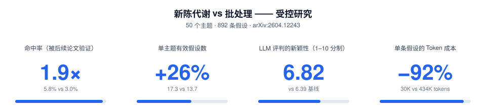

<h1 align="center">Scientify</h1>

  <em>端到端自主演进的 AI 科研系统</em>

  <a href="https://scientify.tech">Scientify.tech</a> · <a href="./README.en.md">English</a>

## 1. 端到端自主研究：持续演进，产出 SOTA 级成果

给 Scientify 一个研究目标，它会自主完成文献调研、假设生成、代码实现、审查和实验验证，并根据结果持续修正研究方向。

Scientify 通过多智能体迭代推进研究。编排器保留研究假设和已有积累，调度独立智能体完成实现、审查和实验。每轮实验的结果都会沉淀为下一轮的经验，让研究沿着更有效的路径持续推进。

### 案例 1：自主发现 KV2 算法，达到领域领先性能

**研究目标**：针对长上下文大语言模型推理，设计一种同时降低首 token 时延和单请求通信量的策略。

Scientify 自主完成文献调研、假设生成、代码实现与消融实验，提出 **KV2 算法**。相较于现有研究，KV2 的首 token 时延第 95 百分位（TTFT p95）和单请求通信量（bytes/request）均有降低，性能达到 **SOTA 水平**。

  
   
  Scientify 自主产出的学术论文，呈现 KV2 的设计思路与实验结果

  
   
  KV2 与现有方法的性能对比

### 案例 2：独立产出黑洞热力学论文，揭示 Gibbs 分岔结构

Scientify 独立完成理论推导、数值分析和论文撰写，产出 [Equilibrium Gibbs Bifurcations of Bardeen-AdS Black Holes at Fixed Pressure](https://arxiv.org/abs/2606.00099v1)。

**研究问题**：在固定压力下，消除黑洞中心奇点的正则化尺度增大时，黑洞的自由能曲线与稳定相如何演变？

- **模型贡献**：针对四维 Bardeen-AdS 黑洞，在直接视界热力学约定下，以 Gibbs 自由能 $G=M-TS$ 建立定压分岔分析框架。通过曲线转折点与自交点分类、正热容筛选和稳定分支的自由能下包络构造，统一描述曲线形态、局部稳定性与平衡相选择。
- **理论贡献**：将压力 $P$ 与正则化尺度 $g$ 的双参数问题化为由 $\lambda=8\pi Pg^2$ 控制的单参数问题，推导出三条分岔边界均满足 $g_i(P)\propto P^{-1/2}$，并解析求得最终单分支边界 $\lambda_s=73/48-13\sqrt{273}/144$。
- **物理发现**：解析与数值分析共同刻画了自由能曲线从类 RN-AdS 燕尾形，经 8 字形、c 形，最终进入单分支的演变序列。稳定性分析表明，首次形态变化后，小黑洞与大黑洞仍可稳定共存；所研究的代表性 c 形状态则没有稳定共存交点。

## 2. 智能体性能领先：相关论文已被 ICML 2026 录用

Scientify 采用**持续知识新陈代谢**模式：持续跟进前沿文献，将新知识与已有积累关联，并用实验结果修正假设。知识、假设与实验经验在多轮研究中持续保留，支持后续研究不断深入。

我们在 **50 个研究主题、892 条生成假设**上，对照测试了Scientify的持续知识新陈代谢与传统Agent的处理模式。Scientify的假设命中率达到基线的 **1.9 倍**，单主题有效假设数增加 **26%**，Token 成本降低 **92%**。

> **论文已被 ICML 2026 录用。**
>
> [Continuous Knowledge Metabolism: Generating Scientific Hypotheses from Evolving Literature](https://arxiv.org/abs/2604.12243)

  

| 指标 | 批处理基线 | 新陈代谢 | 差异 |
|------|-----------|---------|------|
| 命中率：假设方向被后续论文验证的比例 | 3.0% | **5.8%** | **1.9 倍** |
| 单主题有效假设数 | 13.7 | **17.3** | **+26%** |
| LLM 评判的新颖性（1–10 分制） | 6.39 | **6.82** | **+0.43** |
| 单条假设的 Token 成本 | 434K | **30K** | **降低 92%** |

## 3. 如何使用

前往 **[Scientify.tech](https://scientify.tech)**，注册或登录后，在工作区输入你的研究目标即可开始。

Scientify 在隔离云电脑中持续执行研究任务，文献、代码、数据和实验结果保存在同一工作区。关闭电脑后任务继续运行，你可以随时从手机或其他设备查看进度、补充材料并继续研究。
