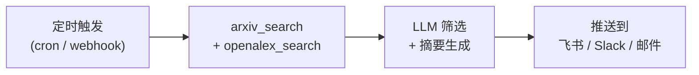
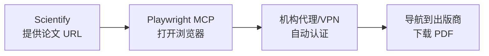
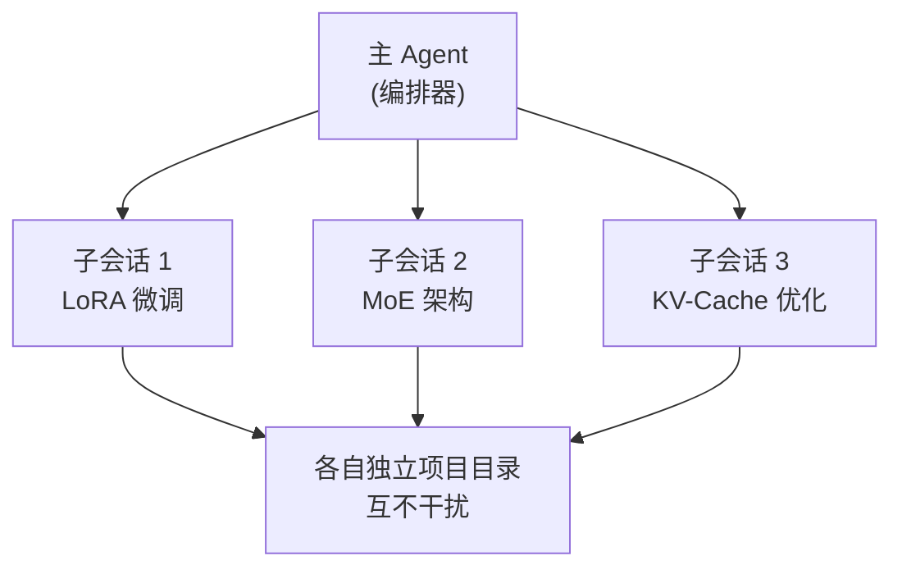
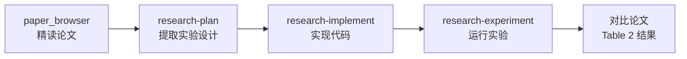

# Scientify

**为 OpenClaw 打造的 AI 驱动研究工作流自动化插件。**

Scientify 是一个 [OpenClaw](https://github.com/openclaw/openclaw) 插件，通过 LLM 驱动的子 agent 自动化完整的学术研究流程 — 从文献调研到实验执行。

**官网：** [scientify.tech](https://scientify.tech) | [English](./README.md)

---

## 它能做什么

Scientify 将一条研究提示转化为完整的自动化流水线。每个阶段由独立子 agent 执行，编排器在步骤间验证产出并传递上下文。

### 场景一 — 端到端研究流水线

> *"研究经典 ML 分类器在 Fashion-MNIST 上的缩放定律"*

**research-pipeline** 编排器依次 spawn 6 个阶段的子 agent：


<details>
<summary><b>各阶段产出详情</b></summary>

| 阶段 | 做了什么 | 产出文件 |
|:-----|:--------|:---------|
| **1. 文献调研** | 搜索 arXiv + OpenAlex，筛选、下载 .tex 源文件，按方向聚类 | `survey/report.md` |
| **2. 深度分析** | 提取公式，映射方法到代码，生成交叉对比 | `survey_res.md` |
| **3. 实现计划** | 四部分计划 — 数据集 / 模型 / 训练 / 测试 | `plan_res.md` |
| **4. 代码实现** | 在 `uv` 隔离虚拟环境中编写 ML 代码，2 epoch 验证 | `project/run.py` |
| **5. 自动审查** | 审查代码 → 修复 → 重跑 → 再审查（最多 3 轮） | `iterations/judge_v*.md` |
| **6. 完整实验** | 全量训练 + 消融实验，生成最终分析 | `experiment_res.md` |

</details>

---

### 场景二 — 创新想法生成

> *"探索蛋白质折叠的最新进展，生成创新研究想法"*

**idea-generation** skill 先调研文献，然后：

1. 基于真实论文生成 **5 个多样化研究想法**
2. 从新颖性、可行性、影响力三个维度打分
3. 选出最佳想法，生成带详细方法论的**增强提案**

> [!TIP]
> **产出：** `ideas/selected_idea.md` — 一份可直接推进的研究提案。

---

### 场景三 — 独立文献调研

> *"调研视觉-语言模型在医学影像中的最新论文"*

只需要一份结构化阅读清单时，单独运行调研阶段：

- 搜索 **arXiv**（CS/ML 方向）和 **OpenAlex**（跨学科，覆盖更广）
- 下载 `.tex` 源文件；通过 **Unpaywall** 获取开放获取 PDF
- 按子主题聚类，提取每个方向的关键发现
- 生成结构化调研报告

> [!TIP]
> **产出：** `survey/report.md` + 原始论文在 `papers/_downloads/`

---

### 场景四 — 综述论文撰写

> *"基于项目研究产出撰写一篇综述论文"*

完成研究流水线（或至少文献调研 + 深度分析）后，**write-review-paper** skill 自动整合：

- 综合调研报告、分析笔记和方法对比表
- 按 Introduction、Related Work、Methods、Discussion 结构组织
- 产出可直接编辑的 Markdown 格式论文草稿

> [!TIP]
> **产出：** 基于项目所有研究产物生成的综述/调研论文草稿。

---

### 进阶场景 — 结合 OpenClaw 平台能力

Scientify 作为 OpenClaw 插件运行，天然可以调用平台的 MCP 服务器、浏览器自动化、多会话并发等能力，组合出更强大的工作流。

---

### 场景五 — 文献推送机器人

> *"每天自动搜索 diffusion model 新论文，筛选后推送到飞书群"*

结合 OpenClaw 的 **MCP 集成**（Slack / 飞书 / 邮件）和 **定时触发**，搭建自动化文献监控：



1. 通过外部 cron 或 OpenClaw webhook 定期触发会话
2. Scientify 的 `arxiv_search` + `openalex_search` 搜索最新论文
3. LLM 按你的研究方向打分筛选，生成中文摘要
4. 通过 MCP 工具推送到飞书群、Slack 频道或邮箱

> [!NOTE]
> **依赖：** 需配置对应的 MCP 服务器（如 `feishu-mcp`、`slack-mcp`）。OpenClaw 支持在 `openclaw.json` 中声明 MCP 服务器。

---

### 场景六 — 浏览器下载付费文献

> *"用学校 VPN 下载这 5 篇 IEEE 论文的 PDF"*

Scientify 内置的 `arxiv_download` 和 `unpaywall_download` 只能获取开放获取论文。对于付费文献，结合 OpenClaw 的 **浏览器自动化**（Playwright MCP）可以突破限制：



- OpenClaw 启动受控浏览器（通过 Playwright MCP server）
- 浏览器通过你的机构代理 / VPN 访问出版商网站
- 自动导航到论文页面，下载 PDF 到项目 `papers/_downloads/`
- 适用于 IEEE、Springer、Elsevier、ACM 等需要机构订阅的出版商

> [!NOTE]
> **依赖：** 需配置 Playwright MCP 服务器，且本机可通过机构网络访问论文。

---

### 场景七 — 多主题并行研究

> *"同时调研 3 个方向：LoRA 微调、MoE 架构、KV-Cache 优化"*

利用 OpenClaw 的 **多会话并发**（`sessions_spawn`），同时启动多条研究流水线：



- 每个子主题独立运行完整流水线，拥有独立项目目录
- 主 agent 收集各方向结果，生成跨主题对比分析
- 适合综述论文选题阶段快速摸底多个方向

---

### 场景八 — 论文精读助手

> *"帮我逐段精读这篇 Attention Is All You Need，解释每个公式"*

结合 OpenClaw 的对话界面和 Scientify 的 `paper_browser` 工具，进行交互式论文阅读：

- `paper_browser` 按页加载论文，避免超长上下文
- 逐节讨论：LLM 解释公式推导、对比相关工作、指出创新点
- 可追问具体实现细节，LLM 用 `github_search` 找到对应开源代码
- 所有分析笔记保存到 `notes/paper_{id}.md`

---

### 场景九 — 从论文到可复现实验

> *"复现这篇论文的 Table 2 实验结果"*

全流程自动化：论文理解 → 代码实现 → 实验复现 → 结果对比：



1. 用 `paper_browser` 精读目标论文的方法和实验部分
2. `research-plan` 提取实验配置（超参、数据集、指标）
3. `research-implement` 生成代码并在 `uv` 隔离环境中验证
4. `research-experiment` 运行完整实验
5. LLM 自动将实验结果与论文原始数据对比分析

---

## 环境要求

- **Node.js** >= 18
- **Python 3** + **uv**（用于 ML 代码执行）
- **git**

---

## 安装 OpenClaw

```bash
# 全局安装 OpenClaw
pnpm add -g openclaw    # 或: npm install -g openclaw

# 运行引导向导（配置模型提供商、API Key、工作空间）
openclaw onboard

# 启动 Gateway（WebUI 服务器）
openclaw gateway
```

启动后，WebUI 地址为 **http://127.0.0.1:18789/**（默认端口）。

> **代理用户注意：** 如果你设置了 `http_proxy`，访问 WebUI 时需加 `--noproxy 127.0.0.1`，或在浏览器中配置代理例外。

---

## 安装 Scientify

### 从 npm 安装（推荐）

```bash
openclaw plugins install scientify
```

插件安装到 `~/.openclaw/extensions/scientify/`，自动启用。

### 从源码安装（开发用）

```bash
git clone https://github.com/user/scientify.git
cd scientify && pnpm install && pnpm build

# 链接为开发插件
openclaw plugins install -l ./
```

### 验证安装

```bash
openclaw plugins list
# 应显示: scientify (enabled)
```

安装后需 **重启 Gateway** 以加载插件：

```bash
# 停止运行中的 Gateway（Ctrl+C），然后：
openclaw gateway
```

---

## 通过 WebUI 使用

### 1. 打开 WebUI

浏览器访问 **http://127.0.0.1:18789/**。

### 2. 开始研究任务

在聊天框中输入研究提示，Scientify 的 skill 会被 LLM 自动匹配：

```
研究 "transformer efficiency"，分析论文并生成创新想法
```

或者用斜杠命令直接调用特定 skill：

```
/research-pipeline
/research-collect
/idea-generation
```

### 3. 监控子 agent 进度

编排器 spawn 子 agent 后，你会看到：
- **启动通知** — "Phase 1: Literature Survey 已启动"
- **完成通知** — 子 agent 完成后自动发送消息
- **进度推进** — 编排器验证产出后自动进入下一阶段

随时查看状态：

```
/research-status
```

### 4. 管理项目

```
/projects              # 列出所有项目
/project-switch <id>   # 切换项目
/papers                # 列出已下载论文
/ideas                 # 列出已生成想法
```

---

## Skills

### 流水线 Skills（LLM 驱动）

| Skill | 斜杠命令 | 描述 |
|-------|---------|------|
| **research-pipeline** | `/research-pipeline` | 编排器。逐阶段 spawn 子 agent，验证产出后推进。 |
| **research-collect** | `/research-collect` | 搜索 arXiv → 筛选 → 下载 .tex 源文件 → 聚类 → 生成调研报告。 |
| **research-survey** | `/research-survey` | 深度分析论文：提取公式、映射代码、生成核心方法对比表。 |
| **research-plan** | `/research-plan` | 从调研结果制定四部分实现计划（数据集/模型/训练/测试）。 |
| **research-implement** | `/research-implement` | 按计划实现 ML 代码，`uv` 虚拟环境隔离，2 epoch 验证。 |
| **research-review** | `/research-review` | 审查实现代码，迭代修复 → 重跑 → 审查，最多 3 轮。 |
| **research-experiment** | `/research-experiment` | 完整训练 + 消融实验。需要 review PASS。 |
| **idea-generation** | `/idea-generation` | 生成 5 个创新研究想法，选出最佳并增强。 |

### 独立 Skills

| Skill | 描述 |
|-------|------|
| **write-review-paper** | 基于项目研究产出撰写综述论文草稿。 |
| **research-subscription** | 通过 `scientify_cron_job` 创建/查看/删除定时 Scientify 任务（研究推送或普通提醒）。 |

### Tools（LLM 可调用）

| Tool | 描述 |
|------|------|
| `arxiv_search` | 搜索 arXiv 论文，返回元数据（标题、作者、摘要、ID）。不下载文件。支持按相关性/日期排序、日期过滤。 |
| `arxiv_download` | 按 arXiv ID 批量下载论文，优先 .tex 源文件（PDF 回退）。需指定绝对路径输出目录。 |
| `openalex_search` | 通过 OpenAlex API 搜索跨学科学术论文，返回 DOI、作者、引用数、OA 状态。覆盖范围比 arXiv 更广。 |
| `openreview_lookup` | 按标题/ID/forum 检索 OpenReview 证据。返回（若存在）决策结论、review 的 rating/confidence 聚合，以及简要审稿摘要，用于投稿风险分析。 |
| `unpaywall_download` | 通过 Unpaywall API 按 DOI 下载开放获取 PDF。非 OA 论文跳过不报错。 |
| `github_search` | 搜索 GitHub 仓库，返回仓库名、描述、star 数、URL。支持语言过滤和排序。 |
| `paper_browser` | 分页浏览大型论文文件（.tex/.md），避免一次性加载数千行到上下文。返回指定行范围和导航信息。 |
| `scientify_cron_job` | 由模型管理 Scientify 定时任务（`upsert`/`list`/`remove`）。主要参数：`action`、`scope`、`schedule`、`topic`、`project`、`message`、`max_papers`、`recency_days`、`candidate_pool`、`score_weights`、`sources`、`channel`、`to`、`no_deliver`、`run_now`、`job_id`。当 `run_now=true` 且是研究任务时，还会返回 `status_json` 快照。 |
| `scientify_literature_state` | 订阅增量状态工具：`prepare` 获取去重上下文（含记忆提示）、`record` 记录已推送论文 + 项目级 `knowledge_state` 产物（含 `paper_notes` 深读字段与全文临时清理日志）、`feedback` 写入轻量偏好记忆、`status` 查看状态与可追溯日志。 |

### Commands（直接执行，不经 LLM）

| 命令 | 描述 |
|------|------|
| `/research-status` | 显示工作空间状态和当前项目 |
| `/papers` | 列出已下载论文及元数据 |
| `/ideas` | 列出已生成想法 |
| `/projects` | 列出所有项目 |
| `/project-switch <id>` | 切换当前项目 |
| `/project-delete <id>` | 删除项目 |
| `/research-subscribe ...` | 创建/更新定时 Scientify 任务（支持 `daily`、`weekly`、`every`、`at`、`cron`；可选参数：`--channel`、`--to`、`--topic`、`--project`、`--message`、`--max-papers`、`--recency-days`、`--candidate-pool`、`--score-weights`、`--sources`、`--no-deliver`） |
| `/research-subscriptions` | 查看你的 Scientify 定时任务 |
| `/research-unsubscribe [job-id]` | 取消你的 Scientify 定时任务（或删除指定任务） |
| `/metabolism-status` | 兼容别名：查看项目 `knowledge_state` 摘要 |

`/research-subscribe` 示例：
- `/research-subscribe daily 09:00 Asia/Shanghai`（默认尽量推送到当前消息来源的用户/频道）
- `/research-subscribe every 2h --channel feishu --to ou_xxx`
- `/research-subscribe at 2m --channel feishu --to ou_xxx`
- `/research-subscribe weekly mon 09:30 --channel telegram --to 123456789`
- `/research-subscribe at 2m --channel webui`（`webui`/`tui` 是 `last` 的别名）
- `/research-subscribe daily 08:00 --topic "LLM alignment"`
- `/research-subscribe daily 08:00 --topic "LLM alignment" --project llm-alignment`
- `/research-subscribe daily 08:00 --topic "LLM alignment" --max-papers 5 --recency-days 30 --sources arxiv,openalex`
- `/research-subscribe daily 08:00 --topic "LLM alignment" --candidate-pool 12 --score-weights relevance:45,novelty:20,authority:25,actionability:10`
- `/research-subscribe at 1m --message "Time to drink coffee."`
- `/research-subscribe daily 09:00 --no-deliver`（仅后台运行，不主动推送）

行为说明：
- Scoped upsert：按 sender/channel 作用域覆盖更新，同一作用域新建任务会替换旧任务。
- Delivery alias：`--channel webui` 和 `--channel tui` 会映射到 `last`，不需要 `--to`。
- 提醒兜底：如果 `topic` 看起来是普通提醒（例如“提醒我睡觉”），Scientify 会自动按提醒消息处理，不走文献流水线。
- 一次性研究任务（`at ... --topic ...`）使用“代表论文聚焦检索”；周期任务（`daily/weekly/every/cron`）保持“增量追踪”模式。
- 周期增量模式会先构建候选池并评分后再选 Top-K；若本轮无“未推送新文献”，会自动再跑一轮代表性回退检索，再决定是否返回空结果。
- 默认 `max_papers` 为 5（可用 `--max-papers` 覆盖）。
- 研究记录内置质量闸门：核心论文全文覆盖率 >= 80%、证据绑定率 >= 90%、引用错误率 < 2%。未达标会自动降级为 `degraded_quality`。
- 轻量偏好记忆（关键词/来源亲和）仅后台保存，不默认展示给用户，会静默影响后续排序。
- 增量去重与偏好状态会持久化到 `~/.openclaw/workspace/scientify/`（`literature-state.json`、`literature-push-log.jsonl`）。
- 项目级研究可追溯状态会持久化到 `~/.openclaw/workspace/projects/{project-id}/knowledge_state/`。
- 全文优先的定时研究会在 `knowledge_state/paper_notes/` 中沉淀逐篇深读记录（领域/子领域/交叉领域/研究目标/方法设计/贡献/经验启发/必读要点/局限/证据锚点）。
- 全文文件建议下载到临时目录并在每轮后清理，清理结果会写入 `knowledge_state` 的 run log。
- 存储位置：订阅任务保存在 OpenClaw cron 存储中；知识状态产物写入项目 workspace 文件。
- 全局查看：`openclaw cron list --all --json`
- 兼容别名：`openclaw research init/list/status/delete` 与 `/metabolism-status` 保留用于迁移，内部都走统一的 `projects/*/knowledge_state` 架构。

---

## 工作空间结构

所有研究数据组织在 `~/.openclaw/workspace/projects/` 下：

```
projects/
├── .active                        # 当前项目 ID
├── scaling-law-fashion-mnist/     # 示例项目
│   ├── project.json               # 元数据
│   ├── task.json                  # 任务定义
│   ├── papers/
│   │   ├── _meta/                 # 论文元数据 (*.json)
│   │   └── _downloads/            # 原始 .tex/.pdf 文件
│   ├── survey/
│   │   └── report.md              # 文献调研报告
│   ├── notes/                     # 逐篇深度分析
│   │   └── paper_{arxiv_id}.md
│   ├── survey_res.md              # 核心方法对比表
│   ├── plan_res.md                # 实现计划
│   ├── project/                   # ML 代码
│   │   ├── run.py
│   │   └── requirements.txt
│   ├── ml_res.md                  # 实现结果报告
│   ├── iterations/                # 审查迭代
│   │   └── judge_v*.md
│   ├── experiment_res.md          # 最终实验结果
│   ├── ideas/                     # 生成的想法
│   │   ├── idea_*.md
│   │   └── selected_idea.md
│   └── knowledge_state/           # 定时研究状态产物
│       ├── knowledge/
│       ├── paper_notes/           # 逐篇深读沉淀
│       ├── daily_changes/
│       ├── hypotheses/
│       ├── logs/
│       ├── state.json
│       └── events.jsonl
└── another-project/
```

---

## 配置

插件设置位于 `~/.openclaw/openclaw.json`：

```json
{
  "plugins": {
    "entries": {
      "scientify": {
        "enabled": true
      }
    }
  }
}
```

### 插件管理

```bash
openclaw plugins list               # 列出已安装插件
openclaw plugins enable scientify    # 启用
openclaw plugins disable scientify   # 禁用
openclaw plugins update scientify    # 更新到最新版
openclaw plugins doctor              # 诊断问题
```

---

## 已知限制

- **子 agent 超时**：每个子 agent 超时 30 分钟（`runTimeoutSeconds: 1800`）。复杂文献调研可能需要更长时间。
- **GPU/Sandbox**：代码默认在宿主机直接执行。OpenClaw sandbox 暂不支持 GPU 透传。
- **模型依赖**：研究质量与使用的 LLM 模型强相关。推荐 Claude Opus 4.5+ 或 GPT-5+。

---

## 开发

```bash
git clone https://github.com/user/scientify.git
cd scientify
pnpm install
pnpm build          # 构建 TypeScript
pnpm dev            # 监听模式

# 链接到 OpenClaw 测试
openclaw plugins install -l ./
```

参见 [CLAUDE.md](./CLAUDE.md) 了解版本更新流程和贡献指南。

---

## License

MIT

## Author

tsingyuai
